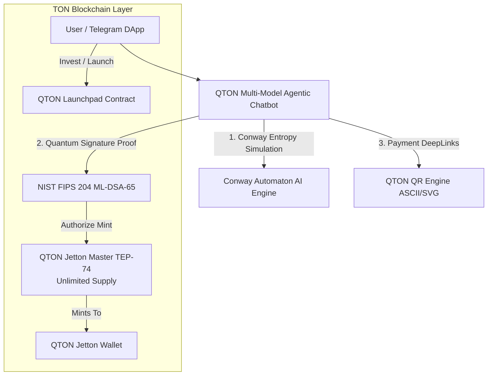

# 💎 QTON (Quantum TON)

> **The Post-Quantum Autonomous Token & Launchpad Ecosystem on TON Blockchain**
> Powered by **TEP-74 Unlimited Supply**, **Conway Automaton AI**, **NIST FIPS 204 ML-DSA-65 PQC**, **Multi-Model Agentics**, and **TON Testnet Integration**.

---

## 🏛️ Ecosystem Overview

`QTON` is a next-generation token infrastructure engineered for the TON (The Open Network) blockchain, featuring:
1. **Unlimited Autonomous Supply**: Built strictly on the **TEP-74 Jetton Standard** with unbounded dynamic minting capacity.
2. **Conway Automaton AI**: 2D cellular automaton engine (B3/S23) coupled with quantum entropy to govern algorithmic emission cycles.
3. **Post-Quantum Cryptography (PQC)**: NIST FIPS 204 (ML-DSA-65 / Dilithium-3) quantum signature verification for state authorization and minting.
4. **Multi-Model Agentic AI**: Multi-provider conversational chatbot engine supporting **Gemini**, **Claude**, **OpenAI**, and **Local LLMs** with autonomous tool dispatch.
5. **Decentralized Launchpad**: Smart contract (`qton_launchpad.fc`) enabling fair launches, bonding curve trading, and project incubation on TON.
6. **Live Testnet Deployment & QR Code Engine**: Automated deployment runner, terminal & SVG QR codes, and integration with TON Testnet RPC (`testnet.toncenter.com`).

---

## ⚡ Deployed Testnet Contract Architecture

| Contract | Function | Testnet Deterministic Address | TonScan Explorer |
| :--- | :--- | :--- | :--- |
| **QTON Jetton Master** | TEP-74 Mintable (Unlimited Supply) | `kQCI8yoRda7UzQSOOypvN_trGrzNb4tGmRR9N-S9LOG-wW58` | [View on TonScan](https://testnet.tonscan.org/address/kQCI8yoRda7UzQSOOypvN_trGrzNb4tGmRR9N-S9LOG-wW58) |
| **QTON Launchpad** | Decentralized Token Incubator | `kQAHuKwr2EhHjjq4wG_xbUA7WtSw9j9OH9rfFrcBvxczgpmh` | [View on TonScan](https://testnet.tonscan.org/address/kQAHuKwr2EhHjjq4wG_xbUA7WtSw9j9OH9rfFrcBvxczgpmh) |
| **QTON Deployer Wallet** | Testnet Wallet V4 | `kQC2Lo6MZgFe-AYQX8QNrtUASqkk_Ka_Shiej2mmkHxLg49t` | [View on TonScan](https://testnet.tonscan.org/address/kQC2Lo6MZgFe-AYQX8QNrtUASqkk_Ka_Shiej2mmkHxLg49t) |

---

## 🧬 Core Technology Pillars



### 1. Unlimited Supply Model
Unlike fixed-supply tokens, QTON operates on an **unbounded, continuous minting model** (`mintable = true`). New QTON tokens are minted autonomously on demand via verified PQC authorizations and Conway automaton density conditions.

### 2. Conway Automaton AI
* Executes 2D cellular automaton generations (`src/automaton/conway_ai.ts`).
* Derives Shannon-von Neumann entropy metrics from cellular population density.
* Dynamic emission factor (`1.0 + 0.5 * entropy`) dynamically adjusts mint volumes based on living grid complexity.

### 3. NIST FIPS 204 PQC Proofs
* Uses `@noble/post-quantum` implementation of **ML-DSA-65 (Dilithium-3)**.
* Off-chain signers create quantum proofs of intent.
* Gateway packs hashes into 256-bit TVM cells for atomic verification.

### 4. Multi-Model Agentic Chatbot
* Seamless routing across **Gemini**, **Claude**, **OpenAI**, and **Local** models.
* Autonomous tool executions:
  * `conway_automaton_step`: Evolves grid state & outputs ASCII visualization.
  * `verify_pqc_proof`: Validates post-quantum digital signatures.
  * `generate_qr`: Builds terminal & SVG QR codes for instant TON transfers.

---

## 🚀 Quickstart & Commands

### 1. Compile Contracts
Compile FunC contracts into TVM BOC bytecodes using the in-process compiler:
```bash
npm run build
```

### 2. Run TVM Sandbox Tests
Execute all 9 test suites across the 6 pillars:
```bash
npm test
```

### 3. Check Testnet Wallet & Scan QR Code
Display wallet address, balance, and terminal QR code:
```bash
npm run wallet:info
```

### 4. Deploy to TON Testnet
Broadcast contract deployment directly to TON Testnet:
```bash
npm run deploy:testnet
```

---

## 📜 License
Apache-2.0. Copyright (c) 2026 elon00.
